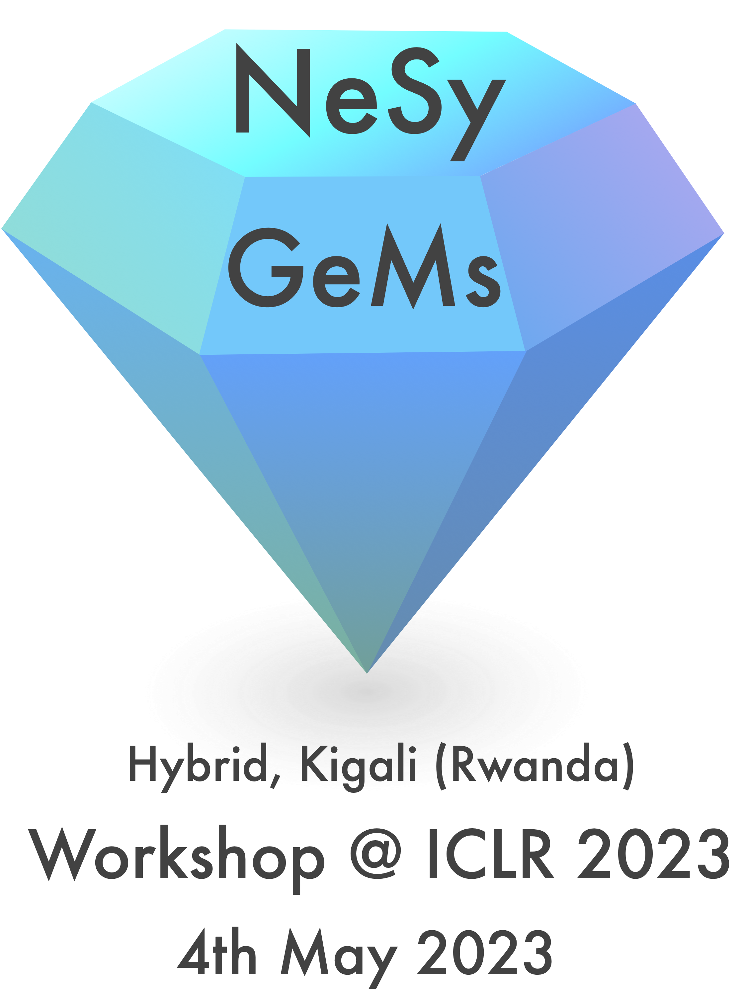

---
# Feel free to add content and custom Front Matter to this file.
# To modify the layout, see https://jekyllrb.com/docs/themes/#overriding-theme-defaults

permalink: /
title:
layout: home
---

  

Neurosymbolic Generative Models have recently gained attention as a promising approach to integrate the strengths of both symbolic reasoning and deep generative modeling. These models combine the ability of symbolic models to explicitly represent abstract concepts and logical reasoning with the ability of neural models to learn and generalize from data.

NeSy-GeMs (Neurosymbolic Generative Models) is a new hybrid workshop at ICLR 2023 to discuss the intersection of Neurosymbolic and generative modeling. You can join us either virtually or in Kigali.

### Important dates
* **Call for Papers released**: Dec. 16th, 2022
* **Paper submission deadline**: Feb. 3rd, 2023 (AoE)
* **Reviews released**: Mar. 3rd, 2023
* **Camera-ready deadline**: Apr. 20th, 2023 (AoE)
* **Hybrid workshop date**: May 4th or May 5th, 2023

We target researchers from different backgrounds. NeSy-GeMs encourages short papers (4 pages) and extended abstracts on recently published work. See the [call for papers](callforpapers.md) for more information.

Papers can be submitted through [Openreview](https://openreview.net/group?id=ICLR.cc/2023/Workshop/NeSy-GeMs).

<!-- For questions, reach out to [our Google Groups](https://groups.google.com/g/nesy-gems2023). -->

### Organizers
- **[Thiviyan Thanapalasingam](https://thiviyansingam.com/)** (University of Amsterdam)
- **[Emile van Krieken](https://emilevankrieken.com)** (Vrije Universiteit Amsterdam)
- **[Halley Young](https://www.cis.upenn.edu/~halleyy/)** (University of Pennsylvania)
- **[Disha Shrivastava](https://shrivastavadisha.github.io/)** (MILA)
- **[Jakub M. Tomczak](https://jmtomczak.github.io/)** (Vrije Universiteit Amsterdam)
- **[Kevin Ellis](https://www.cs.cornell.edu/~ellisk/)** (Cornell University)

### Program Committee
TBA. If you would like to help with reviewing or know someone who could help, fill in [this Google form](https://docs.google.com/forms/d/13aP8zWqTxQ-8AGN8feCtj4OCbV35Mc2UkAkMnS3nLzU/edit?ts=639caee0).

### Contact
We encourage posting all general questions on our [Google Groups](https://groups.google.com/g/nesy-gems2023). For private or specific questions, contact [nesygems2023@gmail.com](mailto:nesygems2023@gmail.com).
