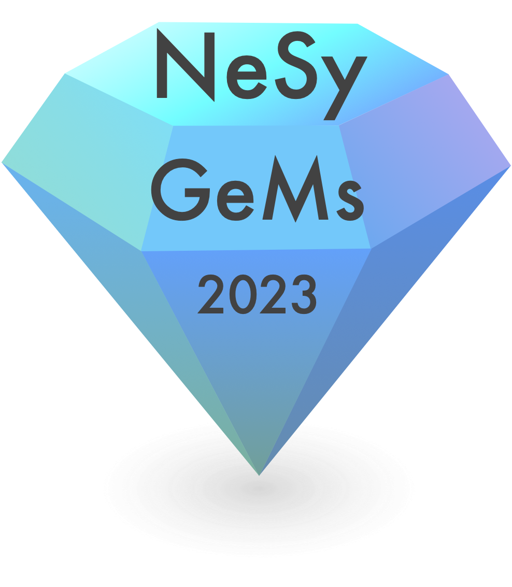

---
# Feel free to add content and custom Front Matter to this file.
# To modify the layout, see https://jekyllrb.com/docs/themes/#overriding-theme-defaults

permalink: /
title:
layout: home
---

  

NeSy-GeMs (Neurosymbolic Generative Models) is a new hybrid workshop at ICLR 2023 to discuss the intersection of Neurosymbolic and generative modeling. Please join us either virtually or in Kigali!

Neurosymbolic Generative Models have recently gained attention as a promising approach to integrate the strengths of both symbolic reasoning and deep generative modeling. These models combine the ability of symbolic models to explicitly represent abstract concepts and logical reasoning with the ability of neural models to learn and generalize from data.

* **Call for Papers released**: Dec. 16th, 2022
* **Paper submission deadline**: Feb. 3rd, 2023 (AoE)
* **Reviews released**: Mar. 3rd, 2023
* **Camera-ready deadline**: Apr. 20th, 2023 (AoE)
* **Hybrid workshop date**: May 4th or May 5th, 2023

We target researchers from different backgrounds. NeSy-GeMs encourages short papers (4 pages) and extended abstracts on recently published work. See the [call for papers](callforpapers.md) for more information.

For questions, reach out to [our Google Groups](https://groups.google.com/g/nesy-gems2023).
